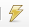

<h1 align="center"><b> SQL za izgubljene </b></h1>


#### STVARANJE BAZE

Za stvaranje baze podataka u SQL-u koristimo sljedeću naredbu


```sql
CREATE DATABASE zaposlenik_artikl;
```


#### POKRETANJE NAREDBE ####

Kako bi pokrenuli kod možemo stisnuti munju u gornjem lijevom kutu iznad koda()

Time možemo provjeriti je li nam komanda ili označeni djelić koda ispravan


#### VRSTE PODATAKA ####

- INTEGER
- CHAR je limitirani string i traži pred definiranu duljinu ( ie.  *prezime CHAR(11)* )
- VARCHAR je varijacija stringa koji može imati maksimalnu duljinu ali će zauzimati količinu memorije ovisno o unesenom stringu
- NUMERIC zahtjeva 2 argumenta: broj sveukupnih brojki u stupcu i koliko njih će biti iza decimalne točke ( ie. *visina NUMERIC(5, 2) *)


Za više informacija o vrstama podataka: [Vrste podataka](https://www.w3schools.com/mysql/mysql_datatypes.asp)


#### STVARANJE TABLICE ####

Za stvaranje tablice koristimo komandu CREATE TABLE te nadodamo naziv i upišemo potrebne podatke za n-torku.

Prije tablice moramo specifično navesti za koju bazu radimo tablice


```sql
USE zaposlenik_artikl;

CREATE TABLE zaposlenik (
	id INTEGER,
	ime VARCHAR(20),
	prezime VARCHAR (20),
	oib CHAR(6),
	datum_zaposlenja VARCHAR(15)
);
```


#### ISPUNJAVANJE TABLICA ####

Za ispunjavanje tablica koristimo komandu INSERT INTO , nadodamo naziv tablice te zaključamo sa ključnom riječi VALUES.

Nakon deklaracije, otvaramo zagradu i pišemo podatke u redoslijedu naših deklariranih vrijednosti.


```sql
INSERT INTO zaposlenik VALUES 
(1, 'Marko', 'Marić', '123451', '10.02.2020.'),
(2, 'Toni', 'Milovan', '123452', '11.02.2020.'),
(3, 'Tea', 'Marić', '123453', '11.02.2020.'),
(4, 'Nina', 'Marko', '123454', '20.02.2020.');
```

Stringovi idu u ( ' ' ) kao u C++


#### ZADACI ZA SUTRA ####

```sql
-- prikaži artikle sa cijenom većom od 10 i sortiraj rezultat prema nazivu silazno
USE zaposlenik_artikl;

SELECT *
	FROM artikl
    WHERE cijena >= 10
    ORDER BY naziv DESC;

-- prikaži zaposlenike čija prezimena započinju sa 'Ma', sa dodatnim stupcem (sa nazivom 'veliko_prezime') koji će prikazati prezime zaposlenika sa velikim slovima
USE zaposlenik_artikl;

SELECT prezime, UPPER(prezime) AS veliko_prezime
	FROM zaposlenik
    WHERE prezime LIKE 'Ma%';

-- prikaži sva imena zaposlenika koja se pojavljuju i kao prezimena zaposlenika
USE zaposlenik_artikl;

SELECT s.ime, z.prezime
	FROM zaposlenik AS z, zaposlenik AS s
    WHERE s.ime = z.prezime;
```


#### PRACTICE DUMP ####

```sql
SELECT naziv
	FROM artikl
    WHERE naziv = 'Puding';
UPDATE artikl
	SET naziv = 'Puding'
    WHERE naziv = 'Puding Ledo';

SELECT naziv
	FROM artikl
    WHERE naziv LIKE '%ud%';

ALTER TABLE artikl MODIFY COLUMN naziv VARCHAR(40);

SELECT s.prezime, z.prezime
	FROM student AS s, zaposlenik AS z
    WHERE s.prezime = z.prezime;

SELECT naziv
	FROM artikl
    WHERE cijena =(
SELECT MAX(cijena) AS vrh
	FROM artikl);
```

